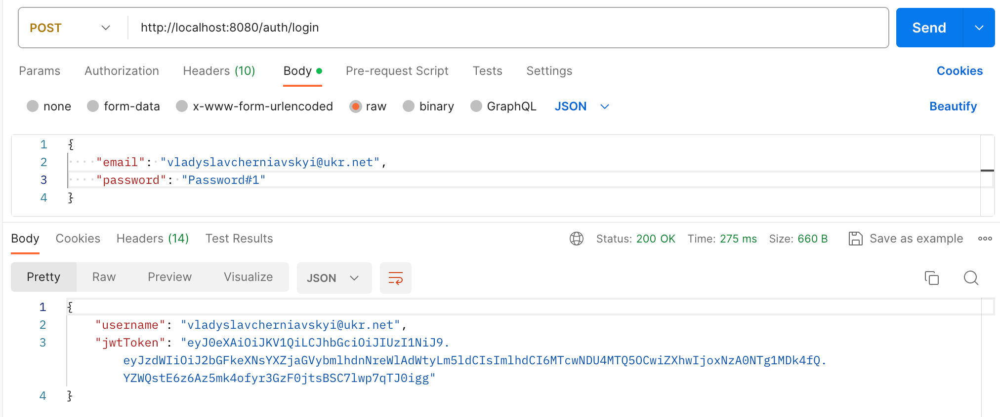

<br/>
<p align="center">
  <h3 align="center">Online Shop</h3>

  <p align="center">
    An Online Store with REST API built with Spring Framework
    <br/>
    <br/>
    <h3 align="center">Languages and Tools:</h3>
<p align="center"> 
  <a href="https://www.java.com" target="_blank" rel="noreferrer">  </a>
  <a href="https://spring.io/" target="_blank" rel="noreferrer">  </a>
  <a href="https://spring.io/projects/spring-security" target="_blank" rel="noreferrer">  </a>
  <a href="https://www.liquibase.com/" target="_blank" rel="noreferrer">   </a>
  <a href="https://hibernate.org/" target="_blank" rel="noreferrer"> </a>
  <a href="https://maven.apache.org/" target="_blank" rel="noreferrer">  </a>
  <a href="https://mapstruct.org" target="_blank" rel="noreferrer">  </a>
 </p>
    <br/>
    <br/>

## Table Of Contents

* [About the Project](#about-the-project)
* [Technologies Used](#technologies-Used)
* [Getting Started](#getting-started)
* [Environment variables](#environment-variables)
* [Authors](#authors)

## About The Project



Welcome to the Online-Shop project! This project is a web application. It is developed to provide users with a
convenient and secure way to manage an online shop. The following features are available:
<ul>
<li> User accounts and authentication
<li> Administrative panel
<li> Product management
<li> Order management
</ul>

This project is built using the Spring Framework and Hibernate, two powerful and widely used technologies in the Java
ecosystem. Spring provides the infrastructure for developing reliable and scalable enterprise-level applications, while
Hibernate simplifies data access with powerful ORM capabilities.

The main functions of this program include creating and managing user accounts, operations with added products,
purchasing goods, and viewing purchase history. The program adheres to the CRUD (Create, Read, Update, Delete) paradigm,
providing a comprehensive and user-friendly interaction.

## Technologies Used

<ul>
<li> Java Core: <a href="https://docs.oracle.com/en/java/"> Oracle Java Documentation </a> </li>
<li> Spring Framework:
<ul> <li> Framework: <a href="https://docs.spring.io/spring-framework/docs/current/reference/html/"> Spring Framework Documentation </a> </li>
     <li> MVC: <a href="https://docs.spring.io/spring-framework/docs/3.2.x/spring-framework-reference/html/mvc.html"> Spring MVC Documentation </a> </li>
     <li> Security: <a href="https://docs.spring.io/spring-security/reference/index.html"> Spring Security Documentation </a> </li> </ul> </li>
<li> Liquibase: <a href="https://docs.liquibase.com/home.html"> Liquibase documentation </a> </li>
<li> Hibernate: <a href="https://hibernate.org/orm/documentation/5.3/"> Hibernate Documentation </a> </li>
<li> Maven: <a href="https://maven.apache.org/guides/index.html"> Maven Documentation </a> </li>
<li> Mapstruct: <a href="https://mapstruct.org/documentation/installation/"> Mapstruct documentation </a> </li>
</ul>

## Getting Started

To get started with the project, follow these steps:

<ul>
<h4> Step 1: Clone the repository </h4>

- `git clone https://github.com/VladyslavCherniavskyi/shop.git`
- `cd shop`
- `./mvnw clean package -DskipTests`

<h4> Step 2: Create a Dockerfile </h4>

<h6 align="left">Use the official Maven image as a base image for building</h6>

- `FROM maven:3.8.4-openjdk-17 AS build`
- `WORKDIR /app`
- `COPY . .`
- `RUN ./mvnw clean package -DskipTests`

<h6 align="left">Use the official OpenJDK image as a base image for running</h6>

- `FROM adoptopenjdk/openjdk17:jre-17.0.1_12-alpine`
- `WORKDIR /app`
- `COPY --from=build /app/target/shop-*.jar app.jar`
- `EXPOSE 8080`
- `ENTRYPOINT ["java", "-jar", "app.jar"]`

<h4> Step 3: Build the Docker Image</h4> 

- `docker build -t shop .`

<h4> Step 4: Run the Docker Container</h4> 

- ```
  docker run -p 8080:8080

  -e DATASOURCE_URL=\...\=shop

  -e DB_USERNAME=\...

  -e DB_PASSWORD=\...

  -e JPA_DATABASE_PLATFORM_DIALECT=org.hibernate.dialect.\ ...

  -e JWT_APP_EXPIRATION_MS=\...

  -e JWT_APP_SECRET_KEY=\...

  -e SQL_PLATFORM=\...
  shop-app```

## Environment variables

- DATASOURCE_URL=**\=shop;
- JPA_DATABASE_PLATFORM_DIALECT;
- JWT_APP_EXPIRATION_MS;
- JWT_APP_SECRET_KEY;
- SQL_PLATFORM.

## Authors

* **Vladyslav Cherniavskyi** - *Java Software Engineer*
* **LinkedIn**- [Vladyslav Cherniavskyi](https://www.linkedin.com/feed/)

